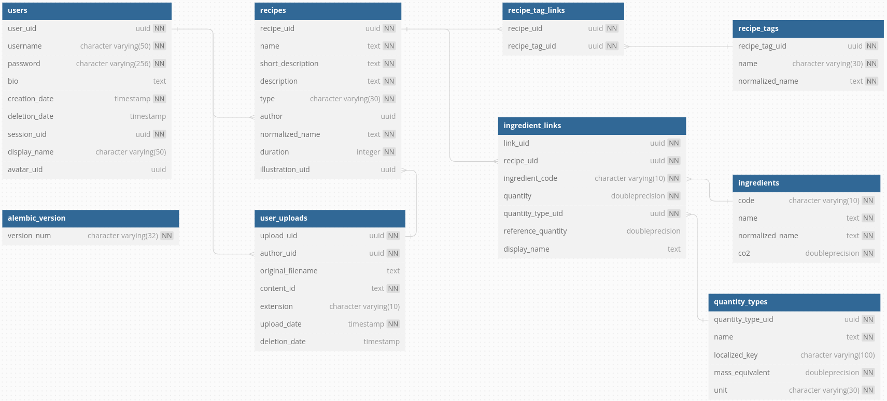

= Base de données

__Ce document a été mis à jour le 04/01/2024.__

Ce document relate de la structure de la base de données du projet. Il est très probable que celle-ci
évolue au cours du projet.

== Tables et relations



Au niveau de la base de données, nous avons 3 tables principales :

* `recipes` qui contient les recettes et les informations qui leur sont liées (nom, description, auteur, ...)

* `ingredients` qui contient les ingrédients, en majorité fournis par link:https://agribalyse.ademe.fr/[AGRIBALYSE]

* `users` qui contient les utilisateurs, et les informations qui leur sont liées (identifiants, bio, avatar, ...)

Les tables `recipes` & `ingredients` sont liées par une table de relation `ingredient_links` qui contient les liaisons
ingrédients-recettes, et les informations de quantités (et d'unités), ainsi qu'un nom d'affichage personnalisable.

Une autre table `quantity_types` contient les types de quantités (masse en gramme, volume en litre, cuillère à café, ...)
et permet de faire les conversions principales entre l'unité associée et une masse en kilogramme. Ainsi on peut afficher
de joli quantité avec des unités de mesures arbitraires, tout en faisant les calculs (notamment l'équivalent Carbone)
avec des kilogrammes.

Par ailleurs, chaque recette peut comporter un emsemble de tags (définies dans la table `recipe_tags`) et dont les liaisons (M-M) sont définies dans la table `recipe_tag_links`.

Quant à la table `users`, elle définie les identifiants, bio, avatar, ... des utilisateurs, et sont liées aux recettes qu'ils ont créées (1-N).
De plus leur avatar est une référence à une ligne de la table `user_uploads`, qui contient les informations de l'image (nom, extension, auteur, emplacement,...).
Il faut noter que les utilisateurs disposent d'un champ `session_uid` qui est un identifiant unique de session, qui est utilisé pour les authentifications. Elle
permet notamment de déconnecter tous les appareils d'un utilisateur lors d'un changement de mot de passe.

La table `user_uploads` est également utilisée pour stocker les images des recettes, qui sont référencées dans la table `recipes` par l'attribut `illustration_uid`.

=== Conventions

* Les quantités (de masse) sont (sauf exeption) exprimées en kilogrammes (kg), et les conversions sont faites à l'affichage. Une exception est faite pour le champ `quantity` de la table `ingredient_links` qui est exprimé dans l'unité de mesure définie par le champ `quantity_type_id`. Par ailleurs le champ `co2` de `ingredients` est exprimé en kilogrammes de CO2 équivalent par kilogramme d'ingrédient.

* Le champ `normalized_name` reprend toujours la valeur du champ `name`, avec pour seule modification sa normalisation en notation ascii (suppression des accents, passage en minuscule, translittération des symboles unicode ...). Ce champ est utilisé pour les recherches.

* Les identifiants des tables sont en règle générale des UUIDv4, générés par le serveur. Cependant, pour les ingrédients, nous avons choisi de garder les identifiants fournis par AGRIBALYSE, qui sont des codes majoritairement numériques.

* La durée de préparation (`duration` dans `recipe`) est exprimée en minutes.

* Pour le moment le champ `localized_key` de `quantity_types` n'est pas utilisé, il est prévu pour une future internationalisation.

=== En savoir plus

Pour plus d'informations sur les tables et les champs, vous pouvez consulter les fichiers `/backend/models/` qui contiennent une description complête des tables et des champs, et généralement des relations entre chacune.

== Utilisation d'un serveur de base de données

Notre projet utilise une base de données PostgreSQL, il est possible qu'une base de données SQLite fonctionne également
mais celle-ci n'a pas été testée. Il est nécessaire de foournir les informations de connexion à cette base dans le fichier
de configuration `/backend/config.toml`, en remplissant le champ `SQLALCHEMY_DATABASE_URI` (exemple disponible dans `/backend/config_dev.toml`).

Afin de créer votre propre base de données nous vous conseillons d'utiliser Flask-Migrate, en utilisant la commande :

```shell
python -m flask db upgrade
```

Cette commande permet de mettre à jour directement la base de données avec les dernières migrations, et d'avoir les
mêmes schémas que le serveur.

Pour peupler vos tables, nous vous conseillons d'utiliser le script `/scripts/Script_ingredients.py` qui permet
de récupérer les données d'AGRIBALYSE et de les insérer dans la table `ingredients`, il ne vous manque alors plus que
des recettes. Vous pouvez trouver un exemple de base de données à importer dans `/scripts/db_test.sql`. Il faut cependant
noter que les ingrédients doivent être ajoutés auparavant sinon les contraintes d'intégrité ne seront pas respectées. En
effet pour des raisons de licences, nous ne pouvons pas fournir une base de données complète, contenant les ingrédients
d'AGRIBALYSE.